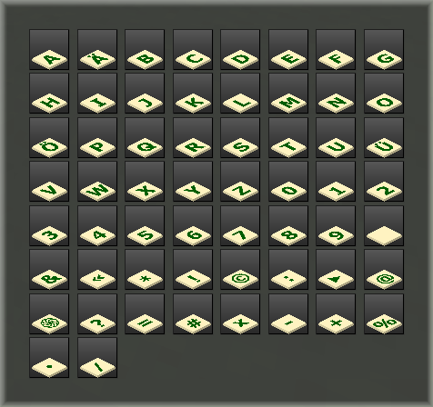

# Zeichen Mod
[Zeichen Mod](https://github.com/mmmsued/zeichen)

Der Mod »Zeichen« enthält Buchstaben (auch deutsche Sonderzeichen), die Zahlen 0-9 und diverse Satz- und andere Zeichen. Abhängigkeiten: default.

With this mod you get some letters (A-Z, even german special chars), numbers and other signs. Depends: default.
## [download](https://github.com/mmmsued/zeichen)

Verwendung:
Im Inventar nach »Zeichen« suchen und das Objekt mit Rechtsklick ablegen. Alle Zeichen können mit dem Schraubenzieher (screw driver) gedreht werden.

Lizenz:
Copyright (C) 2021 Norbert Thien, multimediamobil - Region Süd, Lizenz: Creative Commons BY-SA 4.0
